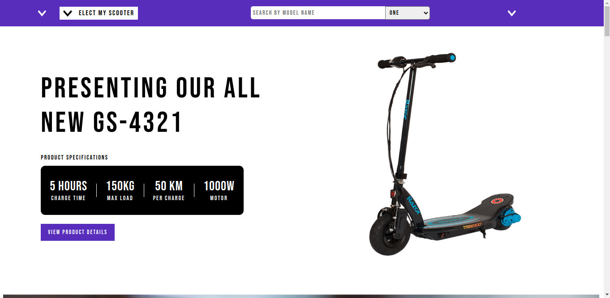
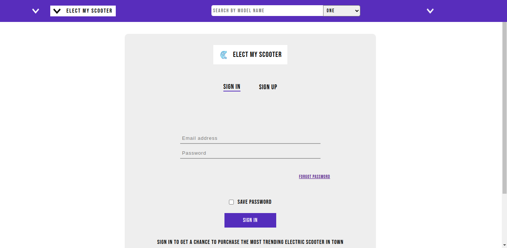
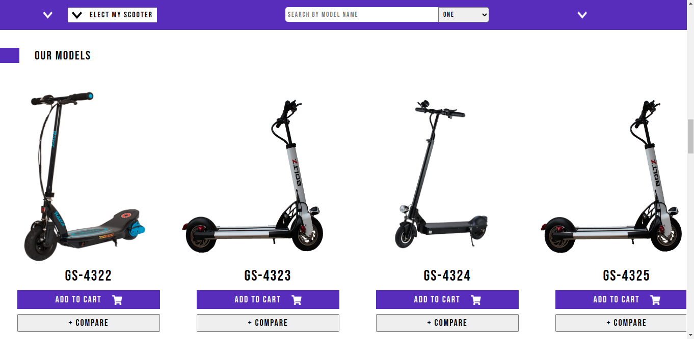
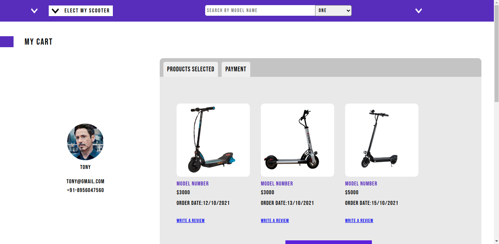
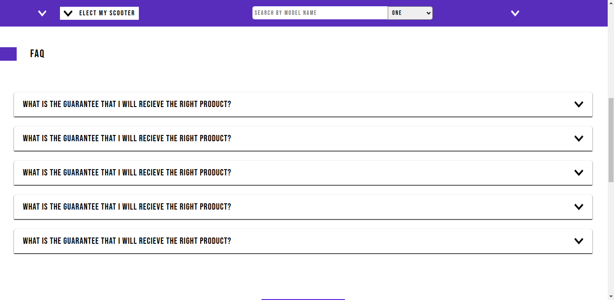
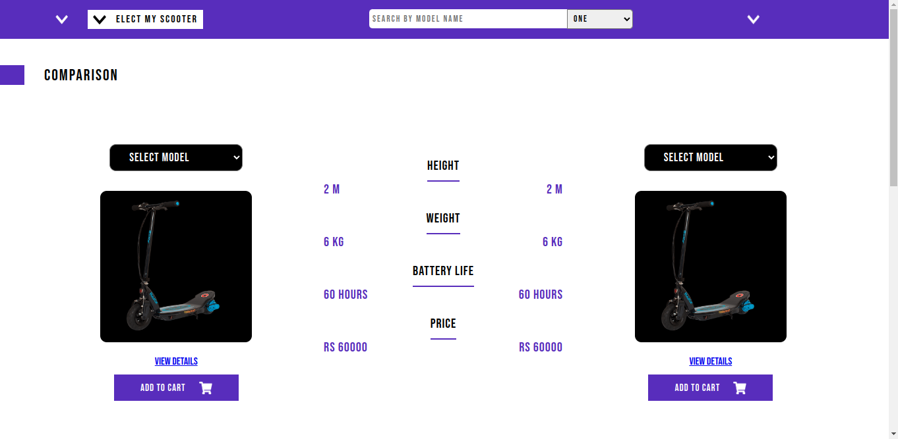

<h1>EMS(elect my scooter)-A scooter selling frontend application</h1>
<h2>Tech Stack Used:</h2>
<h3>Frontend:</h3>
<ul>
	<li>Reactjs</li>
</ul>
<h2>Home Page</h2>

<h2>Login Page</h2>

<h2>Scooters Page</h2>
<i>List of scooters page</li>

<h2>Cart page</h2>
<i>Here user can see what are the items present in his cart</i>

<h2>FAQ Section</h2>

<h2>Comparision page</h2>
<i>Here use can compare the features of scooters by selecting from the dropdown</i>

